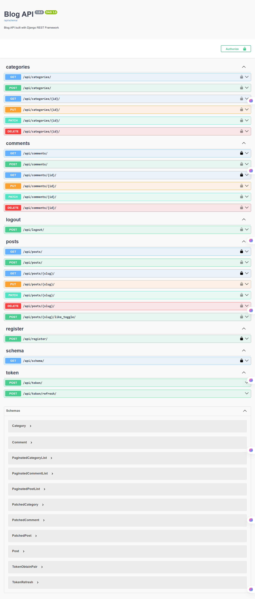

# Blog API (Django REST Framework)

This project is a web API for managing posts, categories, comments, likes, and user authentication with Django REST Framework.



## Main Features

- User registration and authentication
- JWT login and logout
- Category management
- Create, read, update, and delete posts
- Commenting on posts
- Like and unlike posts
- Filtering, searching, and ordering support
- Swagger / OpenAPI API documentation
- Docker and Docker Compose support
- Automated tests with Django TestCase / APITestCase

---

## Technologies Used

- Python 3.12
- Django 6.0.5
- Django REST Framework
- Simple JWT
- PostgreSQL
- Docker / Docker Compose
- WhiteNoise
- drf-spectacular
- django-filter
- psycopg2-binary

---

## Project Structure

```text
.
├── accounts/          # User account app
├── blog/              # Main app (posts, comments, likes, categories)
├── core/              # Django project settings
├── .github/workflows/ # CI GitHub Actions
├── Dockerfile         # Docker image for the app
├── docker-compose.yml # Docker services (web + postgres)
├── requirements.txt   # Python dependencies
└── manage.py          # Django entry point
```

---

## Prerequisites

To run this project locally, you need:

- Python 3.12
- pip
- virtualenv (optional but recommended)
- Docker and Docker Compose (for containerized setup)

---

## Local Setup

### 1) Create a virtual environment

```bash
python -m venv venv
source venv/bin/activate        # Linux / macOS
venv\Scripts\activate           # Windows
```

### 2) Install dependencies

```bash
pip install -r requirements.txt
```

### 3) Configure environment variables

Create a `.env` file in the project root:

```env
SECRET_KEY=your-secret-key
DEBUG=True
ALLOWED_HOSTS=localhost,127.0.0.1

DB_NAME=blog_db
DB_USER=postgres
DB_PASSWORD=your_password
DB_HOST=localhost
DB_PORT=5432
```

> Note: If you use Docker, set `DB_HOST=db`, because the PostgreSQL service is available under that name inside the Docker network.

### 4) Apply migrations

```bash
python manage.py migrate
```

### 5) Run the server

```bash
python manage.py runserver
```

The API will be available at:

```text
http://127.0.0.1:8000/
```

---

## Running with Docker

### 1) Build and start containers

```bash
docker compose up -d --build
```

### 2) Run migrations inside the app container

```bash
docker exec -it blog-container python manage.py migrate
```

### 3) View logs

```bash
docker compose logs -f
```

### 4) Stop services

```bash
docker compose down
```

---

## Main API Endpoints

Base path:

```text
/api/
```

### Authentication

- `POST /api/register/` — Register a new user
- `POST /api/token/` — Obtain JWT tokens
- `POST /api/token/refresh/` — Refresh JWT token
- `POST /api/logout/` — Logout and blacklist the refresh token

### Categories

- `GET /api/categories/`
- `POST /api/categories/`
- `GET /api/categories/<slug>/`
- `PUT /api/categories/<slug>/`
- `PATCH /api/categories/<slug>/`
- `DELETE /api/categories/<slug>/`

### Posts

- `GET /api/posts/`
- `POST /api/posts/`
- `GET /api/posts/<slug>/`
- `PUT /api/posts/<slug>/`
- `PATCH /api/posts/<slug>/`
- `DELETE /api/posts/<slug>/`

### Comments

- `GET /api/comments/`
- `POST /api/comments/`
- `GET /api/comments/<id>/`
- `PUT /api/comments/<id>/`
- `PATCH /api/comments/<id>/`
- `DELETE /api/comments/<id>/`

### Likes

- `POST /api/posts/<slug>/like_toggle/` — Like or unlike a post

---

## API Documentation

After starting the project, Swagger documentation is available at:

```text
http://127.0.0.1:8000/api/docs/
```

The OpenAPI schema is available at:

```text
http://127.0.0.1:8000/api/schema/
```

---

## Running Tests

Run tests locally with:

```bash
python manage.py test
```

Run tests in the Docker container with:

```bash
docker exec -it blog-container python manage.py test
```

---

## CI/CD

This project includes a GitHub Actions workflow at:

```text
.github/workflows/django.yml
```

The workflow:

- installs the project on Python 3.12
- installs dependencies
- starts a PostgreSQL service
- runs the test suite

---

## Important Notes

- For CI test execution, the database variables must be set in the workflow environment.
- If you use Docker, the database service is available as `db` on the Compose network.
- To create a superuser:

```bash
python manage.py createsuperuser
```

---

## Summary

This project is a complete and extensible example of a REST API built with Django REST Framework, suitable for learning, demos, or starting a real application.

